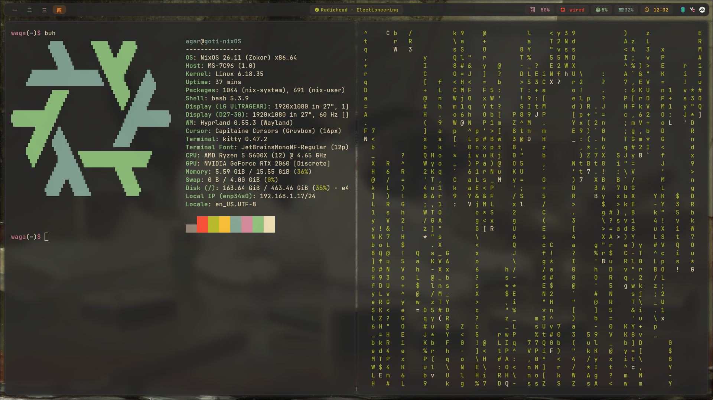

# ❄️ My nixOS dotfiles
*My NixOS configuration with Hyprland, Waybar, and a modular Home Manager setup. Feel free to look around and steal anything useful!*



## Info
| | |
|---|---|
| **OS** | NixOS unstable |
| **WM** | Hyprland (Lua config, v0.55+) |
| **Terminal** | Kitty |
| **Shell** | Bash |
| **Bar** | Waybar |
| **Launcher** | Rofi |
| **File Manager** | Ranger |
| **Theme** | Gruvbox Dark |
| **Font** | JetBrainsMono Nerd Font |
| **Browser** | Firefox |
| **Editor** | Neovim / Vim |
| **GPU** | NVIDIA (open kernel modules) |
| **Cursor** | Capitaine Cursors (Gruvbox) |

## Programs
| Program | Purpose |
|---|---|
| Vesktop | Discord client |
| Feishin | Music player (Navidrome) |
| Prismlauncher | Minecraft launcher |
| Dolphin | GameCube / Wii emulator |
| RetroArch | N64 emulator (Mupen64Plus core) |
| Steam | Game launcher |
| btop | System monitor |
| Flameshot | Screenshots |
| Blueman | Bluetooth manager |
| Pavucontrol | Audio control |
| Hyprpaper | Wallpaper daemon |
| Playerctl | Media control |

## Keybinds
| Keybind | Action |
|---|---|
| `SUPER + Q` | Open terminal (Kitty) |
| `SUPER + C` | Close window |
| `SUPER + R` | Open launcher (Rofi) |
| `SUPER + E` | Open file manager (Ranger) |
| `SUPER + M` | Exit Hyprland |
| `SUPER + SHIFT + P` | Shutdown |
| `SUPER + B` | Open btop |
| `End` | Screenshot (region, swappy) |

## Waybar modules
Left: workspaces — Center: media player (click to play/pause, scroll to skip) — Right: volume, network IP, CPU, RAM, weather, clock, bluetooth

## Structure
```
nixos-dotfiles/
├── flake.nix                  # Entry point, pins nixpkgs + home-manager
├── configuration.nix          # System-level config (NVIDIA, bluetooth, services)
├── hardware-configuration.nix # DO NOT COPY — machine specific
├── assets/
│   ├── screenshot.png
│   └── wallpapers/
├── home/
│   ├── default.nix            # Home Manager root (packages, bash, imports)
│   ├── hyprland.nix           # Hyprland + hyprpaper symlinks
│   ├── waybar.nix             # Waybar config + media script
│   ├── kitty.nix              # Kitty symlinks
│   └── rofi.nix               # Rofi symlinks
└── config/
    ├── hypr/
    │   ├── hyprland.lua       # Hyprland Lua config (Gruvbox, keybinds, monitors)
    │   └── hyprpaper.conf     # Wallpaper config
    ├── waybar/
    │   ├── config.jsonc       # Waybar modules
    │   ├── style.css          # Waybar Gruvbox theme
    │   └── scripts/
    │       └── mediaplayer.py # Media player waybar script
    ├── kitty/
    │   ├── kitty.conf         # Kitty settings
    │   └── gruvbox.conf       # Kitty Gruvbox colors
    └── rofi/
        └── config.rasi        # Rofi Gruvbox theme
```

## Commands
Rebuild and switch (from anywhere):
```bash
switch
```
Which expands to:
```bash
cd ~/nixos-dotfiles && sudo nixos-rebuild switch --flake .#goti-nixOS
```

Commit and push:
```bash
push "your commit message"
```

Update flake inputs (nixpkgs, home-manager):
```bash
nix flake update
switch
```

## Installation
Prerequisites: NixOS installed, flakes enabled.

> ⚠️ **Do NOT copy `hardware-configuration.nix`** — it's specific to my drives and will break your system.

```bash
git clone https://github.com/wagar9386/nixOS ~/nixos-dotfiles
cd ~/nixos-dotfiles
```

Generate your own hardware config:
```bash
sudo nixos-generate-config
cp /etc/nixos/hardware-configuration.nix ~/nixos-dotfiles/
```

Edit `flake.nix` and change `goti-nixOS` to your hostname, then:
```bash
sudo nixos-rebuild switch --flake .#yourHostname
```

## License
MIT — use or distribute freely.
